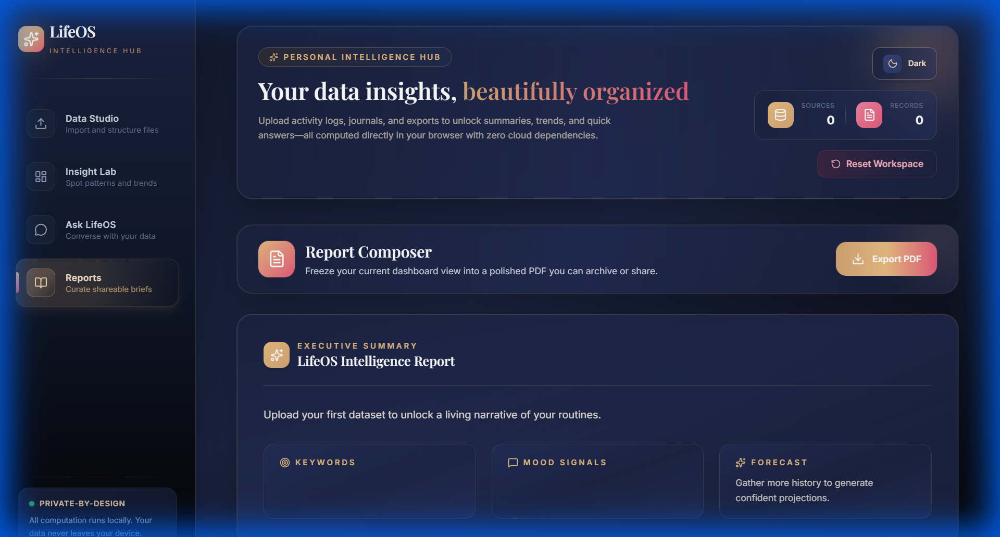
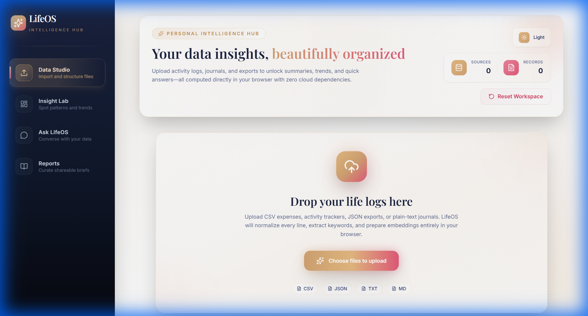
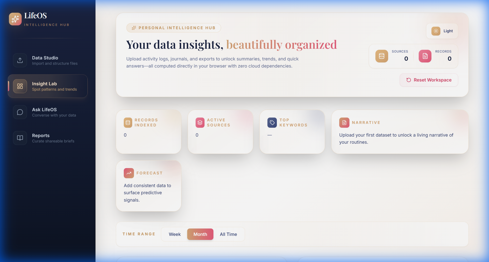
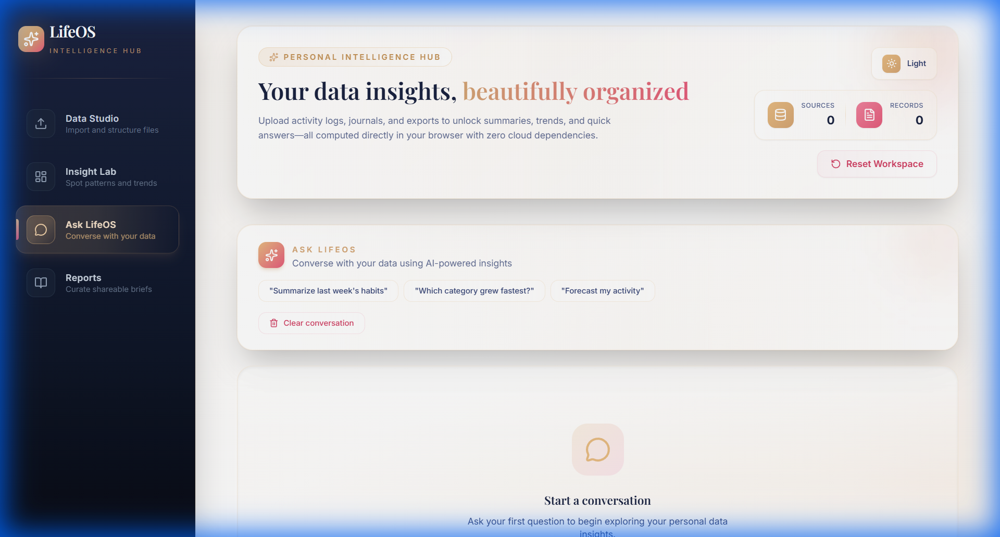
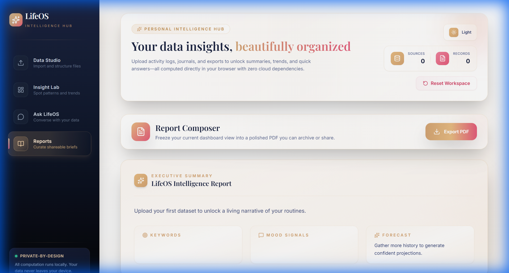

# LifeOS - Personal Intelligence Hub

<div align="center">



**Transform your personal data into actionable insights with a beautiful, privacy-first dashboard.**

[](https://www.typescriptlang.org/)
[](https://reactjs.org/)
[](https://vitejs.dev/)
[](LICENSE)

</div>

---

## ✨ Features

- **🗂️ Data Studio** - Upload and manage CSV, JSON, and TXT files
- **🔍 Insight Lab** - AI-powered analysis with keyword extraction, mood signals, and forecasting
- **💬 Ask LifeOS** - Natural language queries across your indexed data
- **📊 Reports** - Generate beautiful executive summaries and export to PDF
- **🌙 Dark Mode** - Premium dark theme with glassmorphism design
- **🔒 100% Offline** - All data stays on your device, no cloud dependencies

---

## 📸 Screenshots

### Data Studio
Upload and manage your personal data files with drag-and-drop simplicity.



### Insight Lab
Explore AI-generated insights, keywords, mood analysis, and forecasts.



### Ask LifeOS
Query your data using natural language with intelligent responses.



### Reports
Generate comprehensive reports with executive summaries.



### Dark Mode
A stunning dark theme for comfortable late-night analysis.


---

## 🚀 Quick Start

### Prerequisites
- **Node.js** 18.0 or higher

### Installation

```bash
# Clone the repository
git clone https://github.com/yourusername/lifeos.git
cd lifeos

# Install dependencies
npm install

# Start the development server
npm run dev
```

Open [http://localhost:3000](http://localhost:3000) in your browser.

---

## 🛠️ Tech Stack

| Technology | Purpose |
|------------|---------|
| **React 18** | UI Framework |
| **TypeScript** | Type Safety |
| **Vite** | Build Tool |
| **Dexie.js** | IndexedDB Wrapper |
| **Zustand** | State Management |
| **jsPDF** | PDF Export |

---

## 📁 Project Structure

```
LIFE_OS/
├── components/         # React UI components
│   ├── AskLifeOS.tsx  # Natural language query interface
│   ├── DataStudio.tsx # File upload and management
│   ├── InsightLab.tsx # Analytics dashboard
│   ├── Reports.tsx    # Report generation
│   └── ...
├── hooks/             # Custom React hooks
├── storage/           # IndexedDB configuration (Dexie)
├── store/             # Zustand state management
├── utils/             # Utility functions
│   ├── analyzeData.ts # Data analysis engine
│   ├── embeddings.ts  # Local embedding generation
│   └── ...
├── App.tsx            # Main application component
└── index.tsx          # Entry point
```

---

## 🔐 Privacy First

LifeOS is designed with privacy as a core principle:

- ✅ **100% Offline** - No data leaves your device
- ✅ **No API Keys Required** - Works without any external services
- ✅ **Local Storage** - All data stored in browser's IndexedDB
- ✅ **No Tracking** - Zero analytics or telemetry

---

## 📝 License

MIT License - feel free to use this project for personal or commercial purposes.

---

<div align="center">

**Built with ❤️ for personal data sovereignty**

</div>
